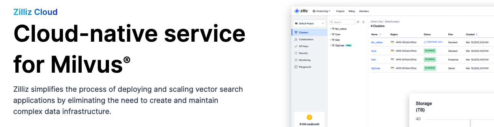
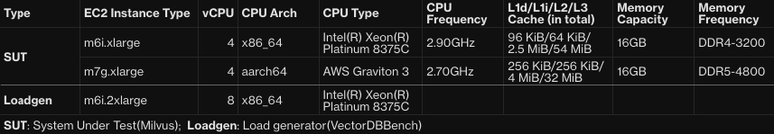
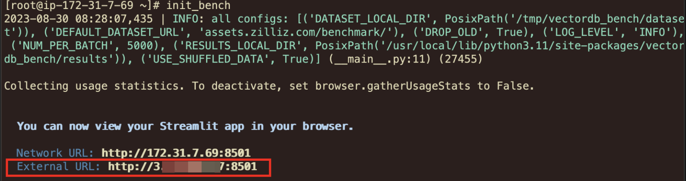
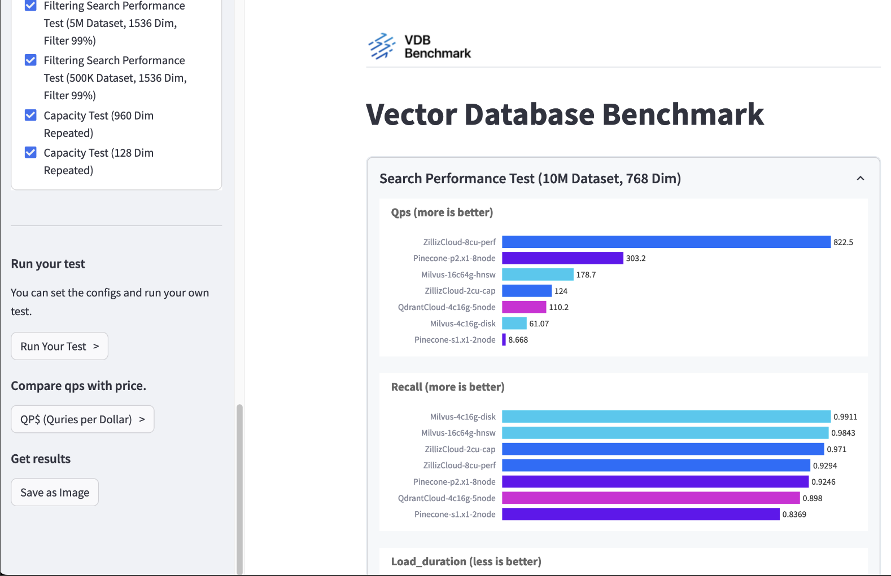
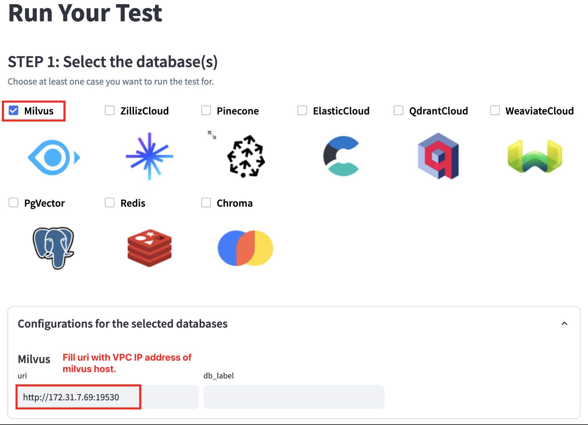
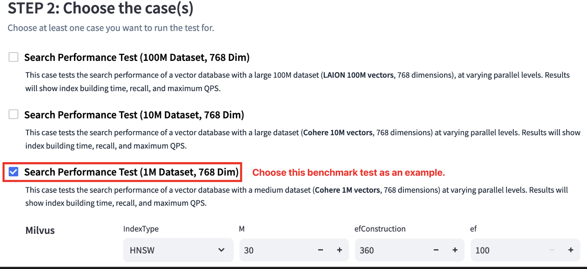
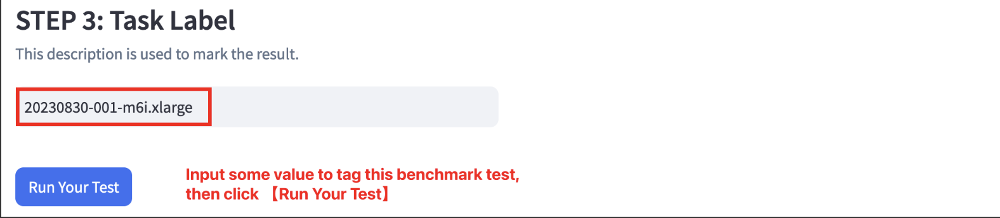
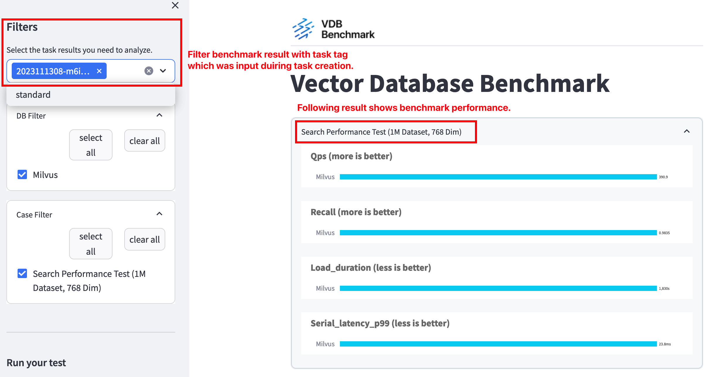
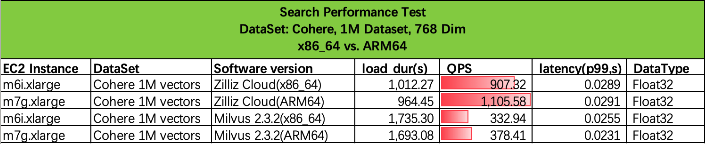

# Achieve Better Price to Performance up to 41% for Zilliz on Amazon with Graviton3 Processors

<picture>
 
</picture>

<sub> _Guest post by Xueyao Bai & Quan Yuan & Wantao Wu, Solution Architect@AWS, Yusheng Ma@Zilliz_ <sub>

The popularity of generative AI (Generative AI) has aroused widespread attention and completely ignited the vector database market. 

According to IDC's forecast, by 2025, more than 80% of business data will be unstructured, stored in text, image, audio, video or other formats. However, storing and querying unstructured data on a large scale is a very big challenge.

The common practice in the field of generative AI and deep learning is to store unstructured data by converting it into vectors, and to search for semantic relevance through vector similarity search (Vector similarity search) technology. Fast storage, indexing and searching of Embedding vectors are the core functions of vector databases.

## About Zilliz

Zilliz is built by the engineers and scientists who created LF AI Milvus®, an open-source vector database for production ready AI. On a mission to unleash data insights with AI, the company builds the database and search technologies to help organizations create AI/ML applications stunningly easy and fast.

## About Amazon Graviton
AWS Graviton processors are designed by AWS to deliver the best price performance for your cloud workloads running in Amazon EC2.

AWS Graviton3 processors are the latest in the AWS Graviton processor family. They provide up to 25% better compute performance, up to 2x higher floating-point performance, and up to 2x faster cryptographic workload performance compared to AWS Graviton2 processors. AWS Graviton3 processors deliver up to 3x better performance compared to AWS Graviton2 processors for ML workloads, including support for bfloat16. They also support DDR5 memory that provides 50% more memory bandwidth compared to DDR4. AWS Graviton3E processors deliver up to 35% higher vector-instruction performance compared to AWS Graviton3 processors. This improvement provides higher performance benefits for HPC applications.

## Benchmark Description&Goal

To better understand what Graviton3 can bring to Zilliz, we will perform load test against Intel Xeon Platinum 8375C. 
Specific details is shown in below table:

<picture>
 
</picture>

<sub> _Graviton3 (m7g) VS Intel Xeon Platinum 8375C (m6i)_ <sub>
* OS and Storages:
    * AMI：Amazon Linux 2023 AMI(latest version)
    * EBS：GP3, 80G(keep default performance level, Throughput 125MB/s, IOPS 3000)


### Zilliz Benchmark Tools & Dataset Introduction

We are using VectorDBBench to perform test. VectorDBBench is a go-to tool for the ultimate performance and cost-effectiveness comparison. Designed with ease-of-use in mind, VectorDBBench is devised to help users, even non-professionals, reproduce results or test new systems, making the hunt for the optimal choice amongst a plethora of cloud services and open-source vector databases a breeze.

We are using Cohere https://huggingface.co/datasets/Cohere/wikipedia-22-12/tree/main/en as testing dataset.

### Methodology

We use the HNSW algorithm to index the Cohere 1M dataset. The HNSW (Hierarchical Navigable Small World) algorithm is an approximate nearest neighbor (ANN) algorithm used for indexing and searching high-dimensional data. It aims to address the challenges of fast nearest neighbor search in high-dimensional spaces where traditional exact k-nearest neighbors algorithm are inefficient. hnsw  algorithm has several parameters that you can configure to customize its behavior.  

* M: This parameter controls the maximum number of connections a data point can have in the hierarchical graph. 
* **fConstruction**: It stands for "ef Construction," and it controls the size of the dynamic list during the construction of the graph.
* **efSearch**: This parameter is used during the search phase and controls the size of the dynamic list while searching for nearest neighbors. A larger efSearch value can lead to a more exhaustive search but also increases query time.

In our tests, we select the same parameters for both ARM64 and X86 platforms. 

We have implemented AVX512, AVX2, and SSE4 SIMD intrinsic optimizations on the x86 platform to accelerate vector distance calculations, On the ARM platform, we have implemented NEON and SVE SIMD intrinsic optimizations. In this bench, we will compare the performance on x86 platform and the latest ARM one for both Milvus and ZillizCloud.


### Milvus Installation

* Logon SUT EC2 instance above with SSH session separately.
* Perform following commands to setup Milvus 2.3.2 benchmark environment:

```
sudo su - root

## Install Docker and docker-compose
dnf install -y docker git htop
systemctl start docker
ARCH=$(arch)
curl -SL https://github.com/docker/compose/releases/download/v2.12.2/docker-compose-linux-${ARCH} \
     -o ./docker-compose
chmod +x docker-compose
mv docker-compose /usr/bin/

## Start milvus container
mkdir ~/milvus
cd ~/milvus
wget https://github.com/milvus-io/milvus/releases/download/v2.3.2/milvus-standalone-docker-compose.yml \
  -O docker-compose.yml
docker-compose up -d
docker-compose ps

```

After above steps, you should get Milvus v2.3.2 running on both instances. 
### VectorDBBench installation

We will install VectorDBBench on LoadGen instance, follow below steps to complete.

```
sudo su - root

## Need isntall Python 3.11 or above
dnf install -y python3.11 python3.11-pip python3.11-devel git gcc gcc-c++
python3.11 -V

## Install VectorDBBench
pip3.11 install vectordb-bench
which init_bench

## Redirect /tmp/vectordb_bench to another location
mkdir -p /mnt/vectordb_bench
ln -s /mnt/vectordb_bench /tmp/vectordb_bench

## init benchmark tool，follow the prompt to enter web page
init_bench
```
<picture>
 
</picture>

Visit VectorDBBench Web Console via External URL, make sure you have allowed port 8501 in security group and allow the traffic in your VPC.

<picture>
 
</picture>

### Peform loadtest

* Press 【Run Your Test >】button to enter benchmark configurations, follow the instruction shown below to configure the benchmark tool.

<picture>
 
</picture>

<picture>
 
</picture>

<picture>
 
</picture>


### Explore Result 

* After all bechmark tests complete, you can find result via SSH session

<picture>
 
</picture>

### Performance Comparison between Intel & Graviton3 instances

After above test running against m6i (Intel) m7g(Graviton3), we have final result as below:

<picture>
 
</picture>

## Summary

Our test shows that general performance of Zilliz Cloud on Graviton3 (m7g) achieve better QPS (21.85%) than Intel Xeon Platinum 8375C (m6i). 
Milvus 2.3.2 on Graviton3(m7g) is also providing 13.65% gain on QPS compare to Intel on m6i instance.
Take the price into consideration, our result shows Graviton3 can bring up to 41% increase compare to x86 processors on m6i series intance.

We encourage readers to try Graviton3 whenever possible and feel the pricing to performance improvement on Graviton3.

## Reference
* VDBBench https://github.com/zilliztech/VectorDBBench
* Cohere https://huggingface.co/datasets/Cohere/wikipedia-22-12/tree/main/en
* AWS EC2 Pricing https://aws.amazon.com/ec2/pricing/on-demand/

